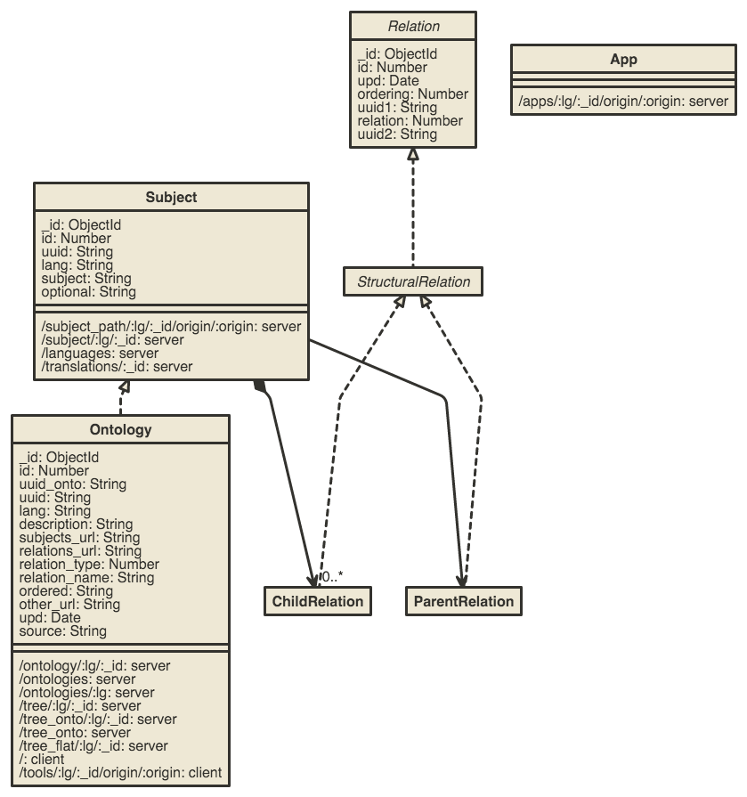

# subjectrawl
SubjectRaw project on Meteor - semantic web content



```uml

[Ontology
	|
	_id: ObjectId;
	id: Number;
	uuid_onto: String;
	uuid: String;
	lang: String;
	description: String;
	subjects_url: String;
	relations_url: String;
	relation_type: Number;
	relation_name: String;
	ordered: String;
	other_url: String;
	upd: Date;
	source: String
	|
	|
	/ontology/:lg/:_id: server;
	/ontologies: server;
	/ontologies/:lg: server;
	/tree/:lg/:_id: server;
	/tree_onto/:lg/:_id: server;
	/tree_onto: server;
	/tree_flat/:lg/:_id: server;
	/: client;
	/tools/:lg/:_id/origin/:origin: client
]

[Subject
	|
	_id: ObjectId;
	id: Number;
	uuid: String;
	lang: String;
	subject: String;
	optional: String
	|
	|
	/subject_path/:lg/:_id/origin/:origin: server;
	/subject/:lg/:_id: server;
	/languages: server;
	/translations/:_id: server
]

[<abstract>Relation
	|
	_id: ObjectId;
	id: Number;
	upd: Date;
	ordering: Number;
	uuid1: String;
	relation: Number;
	uuid2: String
]<:--[<abstract>StructuralRelation]
[StructuralRelation]<:--[ChildRelation]
[StructuralRelation]<:--[ParentRelation]


[App
	|
	|
	|
	/apps/:lg/:_id/origin/:origin: server
]

[Subject]+-> 0..* [ChildRelation]
[Subject]->[ParentRelation]
[Subject]<:--[Ontology]


```

Data is loaded by uncommenting line 77-78 from server->server.js: [https://github.com/loredanacirstea/subjectrawl/blob/master/server/server.js#L77](https://github.com/loredanacirstea/subjectrawl/blob/master/server/server.js#L77)
cvs data should be in [private](https://github.com/loredanacirstea/subjectrawl/tree/master/private) folder

